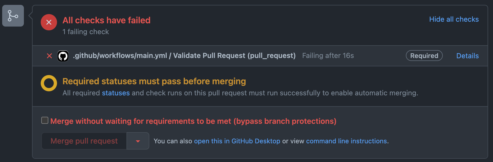

<h1 align="center">PR Keeper</h1>

<!-- PROJECT SHIELDS -->
<!-- <p align="center">
  <a href="package_link_here">
    
  </a>
  &nbsp;
  <a href="https://github.com/actions/typescript-action/actions"></a>
  &nbsp;
  <a href="package_link_here">
    
  </a>
</p> -->

<p align="center">
  A GitHub action to validate Pull Request's title and description consistent convention
</p>

<br />

- **Pull Request Title**: Validate Pull Request's title convention against the regular expression.
- **Pull Request Description**: Validate Pull Request's description convention against the regular expression.
- **Valid Pull Request Label**: If the Pull Request's title and description convention is valid then a label will be attached on the Pull Request.
- **Custom Regular Expression & Label name**: User can add custom regex to validate the Pull Request's title and description and can also add custom label name for valid Pull Request status.

##### Valid Pull Request


##### Invalid Pull Request




## Usage

Create a `.github/workflows/${YOUR_WORKFLOW_NAME}.yml` file in your GitHub repo and add the following code.

```
on:
  pull_request:
    types: [opened, edited, synchronize, reopened]

jobs:
  validate_pr:
    runs-on: ubuntu-latest
    name: Validate Pull Request
    steps:
      - name: validate PR
        id: validatePR
        uses: Techwards/pr-keeper@1.0
        with:
          token: ${{ secrets.GITHUB_TOKEN }}
```

This GitHub action uses default regular expression for title and description convention validation and default label name if the pull request is valid.

**Custom Action Values:** Users can also add their custom regular expression and custom label name. Follow the examples section.


## Examples

**Example 1:** Using custom title regular expression and default description regular expression and default label name

```
on:
  pull_request:
    types: [opened, edited, synchronize, reopened]

jobs:
  validate_pr:
    runs-on: ubuntu-latest
    name: Validate Pull Request
    steps:
      - name: validate PR
        id: validatePR
        uses: Techwards/pr-keeper@1.0
        with:
          token: ${{ secrets.GITHUB_TOKEN }}
          title-regex: >
            ^Ticket\s\#[1-9]{1,}$
```

**Example 2:** Using custom description and default title regular expression and default label name

```
on:
  pull_request:
    types: [opened, edited, synchronize, reopened]

jobs:
  validate_pr:
    runs-on: ubuntu-latest
    name: Validate Pull Request
    steps:
      - name: validate PR
        id: validatePR
        uses: Techwards/pr-keeper@1.0
        with:
          token: ${{ secrets.GITHUB_TOKEN }}
          description-regex: >
            This\sPull Request\s(closes|fixes)\s\[\#[0-9]{1,}\]
```

**Example 3:** Using default title and description regular expression and custom label name

```
on:
  pull_request:
    types: [opened, edited, synchronize, reopened]

jobs:
  validate_pr:
    runs-on: ubuntu-latest
    name: Validate Pull Request
    steps:
      - name: validate PR
        id: validatePR
        uses: Techwards/pr-keeper@1.0
        with:
          token: ${{ secrets.GITHUB_TOKEN }}
          validation-label: Valid Pull Request Convention
```

**Example 4:** Using custom title and description regular expression and custom label name

```
on:
  pull_request:
    types: [opened, edited, synchronize, reopened]

jobs:
  validate_pr:
    runs-on: ubuntu-latest
    name: Validate Pull Request
    steps:
      - name: validate PR
        id: validatePR
        uses: Techwards/pr-keeper@1.0
        with:
          token: ${{ secrets.GITHUB_TOKEN }}
          title-regex: >
            ^Ticket\s\#[1-9]{1,}$
          description-regex: >
            This\sPull Request\s(closes|fixes)\s\[\#[0-9]{1,}\]
          validation-label: Valid Pull Request Convention
```


## Inputs table

| Name | Required | Default | Description |
| ---- | -------- | ------- | ----------- |
| `token` | `true` | `none` | A GitHub authentication token |
| `title-regex` | `false` | ```^(Feature\|Fix\|Task)\s\|\sIssue\s\#[1-9]{1,}\s\|\s[\w\s\']\*$``` | A regular expression to validate the PR's title convention. Can also provide custom regular expression |
| `description-regex` | `false` | ```This\sPR\scloses\s\[\#[0-9]{1,}\]\((https?:\/\/)?(?:www\.)?[-a-zA-Z0-9@:%._\+~#=]{1,256}\.[a-zA-Z0-9()]{1,6}\b(?:[-a-zA-Z0-9()@:%_\+.~\#\?\&\/\=]*)\)``` | A regular expression to validate the PR's description convention. Can also provide custom regular expression |
| `validation-label` | `false` | Ready for Review | A label will be attached on the PR if the PR is valid. Can also provide custom label name |

## Credits

[TypeScript GitHub Action Template](https://github.com/actions/typescript-action) by [GitHub Actions](https://github.com/actions).

## License

Distributed under the MIT License. See `LICENSE` for more information.
